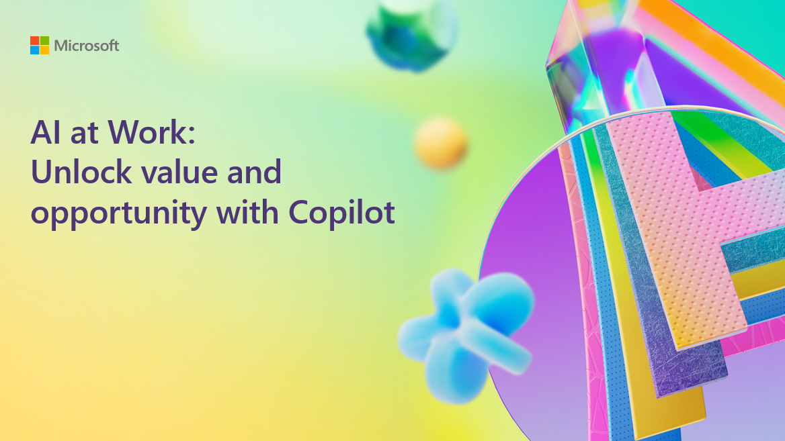

# BRK310: AI at Work: Unlock value and opportunity with Microsoft Copilot

## Session Desciption

Microsoft Copilot unleashes AI’s capabilities across every role and function to transform personal productivity and reinvent how organizations operate.  Join us to understand the business value already realized in the era of AI and what leaders are doing today to build an AI-powered enterprise.

## Session Resources
You can find slides of the presentation here.

| Resources          | Links                             | Description        |
|:-------------------|:----------------------------------|:-------------------|
| BRK310 English-language PPT Slides | [Link 1](https://aka.ms/xxxxxxx/) | Presentation deck in English|

## Content Owners
Matt McKenzie, Director Product Marketing, Microsoft
