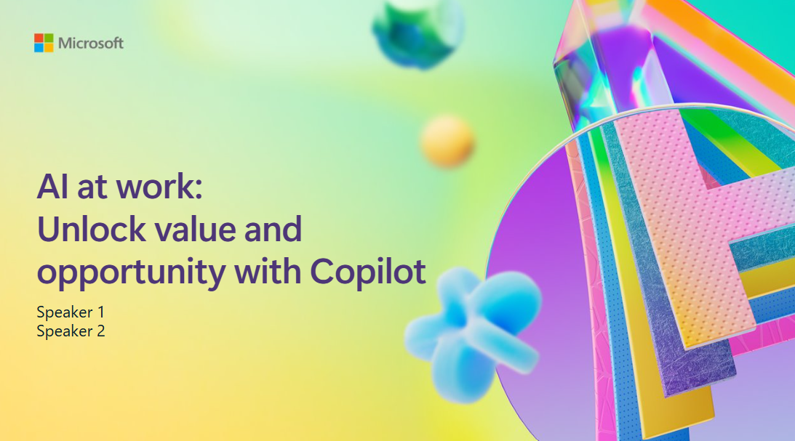

# AI at Work: Unlock value and opportunity with Microsoft Copilot

## Session Desciption

Microsoft Copilot unleashes AI’s capabilities across every role and function to transform personal productivity and reinvent how organizations operate.  Join us to understand the business value already realized in the era of AI and what leaders are doing today to build an AI-powered enterprise.

## Goal
TODO: Add a list of what you hope the attendee will take away from this session. This can be skills, technology, appreciation, etc.

## Key audience takeaways
TODO: Add a list of any technology or software used.

## Session Resources
You can find additional resources, including the slides of the presentation here.

| Resources          | Links                             | Description        |
|:-------------------|:----------------------------------|:-------------------|
| Presentation  | [Link 1](https://www.google.com/) | coming soon|
| Session recording  | [Link 2](https://www.google.com/) | coming soon |

## Content Owners
Add here
